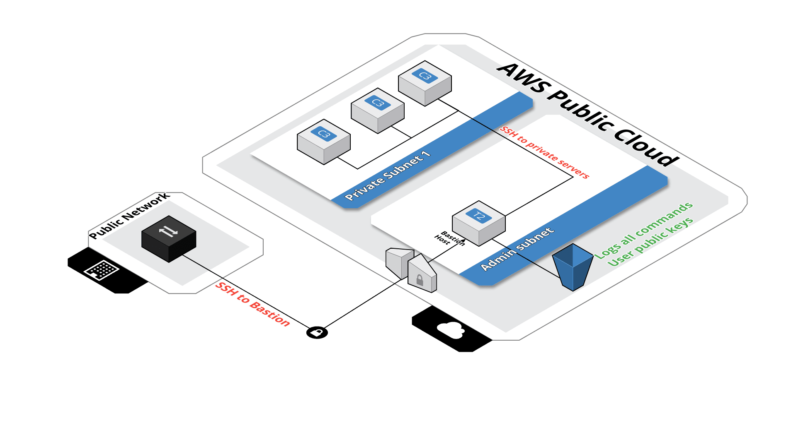

# Terraform module: Bastion Host

Terraform module que cria um _bastion host_ (jump box) para acesso SSH seguro em instâncias privadas da AWS.

Inspirado por  [How to Record SSH Sessions Established Through a Bastion Host
](https://aws.amazon.com/blogs/security/how-to-record-ssh-sessions-established-through-a-bastion-host/) e originalmente nascido através do _fork_ de um [repositório público](https://github.com/Guimove/terraform-aws-bastion).

## Features

Arquitetura do módulo:


Todos os comandos executados através do _bastion host_ são registrados em bucket S3 na pasta /logs, podendo ser replicados e auditados.

O bucket possui também uma pasta /public-keys, devidamente criptografada.

Para criar novos usuários com acesso privilegiado em suas instâncias da VPC em subnet privada, basta colocar a chave pública do usuário nesta pasta do bucket. O arquivo da chave deve estar no formato _'username.pub'_. Assim, o Bastion Host irá criar um usuário com nome _'username'_ no bastion server.

Assim o arquivo <s3 bucket>/log/users-changes.txt tiver uma entrada referente ao usuário, significa que o _bastion host_ já criou o novo usuário:

```
2020-09-14 00-35-03: Criada conta para obiwan (public-keys/obiwan.pub)
```

Assim, basta conectar: 

```sh
ssh [-i path_to_bastion_private_key] obiwan@bastion-dns-name
```

## Chave de Acesso

Primeiramente, você deve pedir a chave privada das instâncias privadas para o administrador da rede.

A idéia do _bastion host_ dentro da nossa arquitetura é controlar o acesso externo por chave individual de usuário e centralizar e distribuir a chave (s) de instâncias privadas através de um administrador.

Isso não é considerado uma vulnerabilidade, pois o acesso às instâncias privadas, se dá somente através do _bastion host_.
Todavia, cabe lembrar ao administrador a necessidade de substituir as chaves privadas de tempos em tempos como medida extra de segurança.

Assim, a cada novo usuário basta que o mesmo gere um par de chaves e passe a chave pública para o administrador colocar no S3 bucket.

Se você já tem uma chave PEM, você pode extrair a chave pública equivalente com o seguinte comando:

```
ssh-keygen -y -f /path_to_key_pair/my-key-pair.pem > obiwan.pub
```

Caso contrário, pode gerar uma chave com OpenSSH, por exemplo:

```
ssh-keygen -t rsa -b 4096
```

E utilizar o keygen para gerar um .pem:

```
ssh-keygen -m PEM
```

Mais ainda, recomenda-se manter o acesso às chaves restrito:

```
chmod 400 my-key-pair.pem
```

## Conectando Em Instância Privada

Dentro do SSH existe um verdeiro arsenal de ferramentas para gerenciar chaves e acessos.

Assim, nos limitados a demonstrar apenas duas formas de acesso às instâncias privadas, ambas utilizando o ssh-agent para facilitar o acesso as chaves.

Assim primeiramente devemos adicionar as chaves ao agent:

```sh
ssh-add path_to_bastion_private_key
ssh-add path_to_instance_private_key
```

### Modo 1: passo à passo

Acessar o _bastion host_ com agent forwarding:

```sh
ssh -A obiwan@bastion-dns-name
```

Desta forma, as chaves são carregadas _na memória_ do bastion e, assim, é possível se conectar a instância privada utilizando:

```sh
ssh ubuntu@private-instance-ip
```

### Modo 2: ProxyJump

A partir o SSH versão 7.3 é possível fazer um _ProxyJump_ e acessar a máquina privada em um comando apenas:

```
ssh -J obiwan@bastion-dns-name ubuntu@private-instance-ip
```

## Utilizando o Módulo no Terraform

```hcl
module "bastion" {
  source                     = "git@github.com:ReginaldoSantos/terraform-aws-bastion.git"
  bucket_name                = "${local.env}-bastion"
  region                     = local.region.name
  vpc_id                     = aws_vpc.default.id
  is_lb_private              = false
  bastion_host_key_pair      = "name-to-adm-aws-key"
  create_dns_record          = true
  hosted_zone_id             = "aws_route53_zone.domain_zone.zone_id"
  bastion_record_name        = "bastion.${local.env}.${local.domain}"
  bastion_iam_policy_name    = "${local.env}BastionHostPolicy"
  elb_subnets                = [aws_subnet.public_subnet1.id, aws_subnet.public_subnet2.id]
  auto_scaling_group_subnets = [aws_subnet.public_subnet1.id, aws_subnet.public_subnet2.id]
  log_auto_clean             = true

  tags = merge(
    local.tags,
    {
      Name        = "bastion-${local.env}"
      Description = "Bastion host para acesso externo via SSH"
    }
  )
}
```
## Inputs

| Name | Description | Type | Default | Required |
|------|-------------|:----:|:-----:|:-----:|
| auto_scaling_group_subnets | Lista de subnets onde o ASG irá construir as instâncias | list | - | yes |
| allow_ssh_commands | Quando 'True' permite a execução os comandos passados via SSH. Este comandos não são gravados. Use com descrição | string | "" | no |
| bastion_host_key_pair | Key pair utilizada na contrução do bastion | string | - | yes |
| bastion_instance_count | Número de bastions à serem criados na VPC | string | `1` | no |
| bastion_launch_template_name | Nome do template de launch configuration utilizado também pelo ASG | string | `lc` | no |
| bastion_ami | AMI utilizada pelo bastion. Se não informado, a Amazon2 AMI mais recente é utilizada | string | `` | no |
| bastion_record_name | DNS record para o bastion | string | `` | no |
| bastion_iam_policy_name | IAM Policy criado para o bastion ter acesso ao bucket | string | `BastionHost` | no |
| bucket_name | Nome do bucket onde os logs serão armazenados | string | - | yes |
| bucket_force_destroy | Força remoção de bucket e seus objetos no _terraform destroy_ | string | false | no |
| bucket_versioning | Habilita versionamento no bucket | string | true | no |
| cidrs | Lista de CIDRs que podem acessar o bastion. Default: 0.0.0.0/0 | list | `<list>` | no |
| create_dns_record | Quando true cria um DNS record para o bastion (LB). Se true 'hosted_zone_id' e 'bastion_record_name' se tornam obrigatórios | integer | - | yes |
| elb_subnets | Lista de subnets onde o NLB será construído | list | - | yes |
| extra_user_data_content | Script adicional para passar para o bastion | string | `" "` | no |
| hosted_zone_id | Nome da hosted zone onde o DNS name do bastion deve ser registrado | string | `` | no |
| instance_type | Instance type do bastion | `string` | `" t3.nano "` | no |
| is_lb_private | Se true o NLB será "internal" senão "internet-facing" | string | - | yes |
| log_auto_clean | Ativa ou não o lifecycle do bucket | string | `false` | no |
| log_expiry_days | Número de dias antes de apagar os logs | string | `90` | no |
| log_glacier_days | Número de dias antes de mover os logs para o Glacier | string | `60` | no |
| log_standard_ia_days | Número de dias antes de mover os logs para IA Storage | string | `30` | no |
| private_ssh_port | SSH port entre bastion e instância privada | string | `22` | no |
| public_ssh_port | SSH port entre desktop e o bastion | string | `22` | no |
| region | | string | - | yes |
| tags | Mapa de tags para atribuir os resources de modo geral | map | `<map>` | no |
| vpc_id | Identificador da VPC onde o bastion será construído | string | - | yes |

## Outputs

| Name | Description |
|------|-------------|
| bucket_name | Bucket criado para armazenar logs e chaves |
| elb_ip | DNS Name do NLB criado para expor o(s) bastion (s) |
| bastion_host_security_group | Security Group Id do(s) bastion(s) |
| private_instances_security_group | Security Group Id que pode ser utilizado pelas instâncias privadas para permitir acesso via bastion |


## License

Apache 2 Licensed. See LICENSE for full details.


